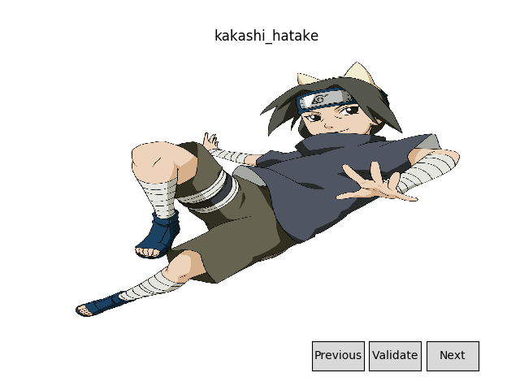

# Naruto Character Recognition and Analysis

Given a scene from an episode of *Naruto*, track major character's faces, and identify the symbol on their headband.

### Source Clips
Some example clips we're planning to be able to run on:
 - [Naruto Shippuden Opening 18](https://www.youtube.com/watch?v=HdgD7E6JEE4)
 - [Naruto Opening 2](https://www.youtube.com/watch?v=SRn99oN1p_c)
 - [Naruto and Hinata Wedding](https://www.youtube.com/watch?v=BoMBsDIGkKI)

### Facial Detection Network
Some options:
 - [MTCNN](https://arxiv.org/abs/1604.02878)
 - [YOLO](https://arxiv.org/pdf/1506.02640v5.pdf)

### Tasks
- [ ] Create a dataset of character faces with tags, pulling character images from [Jikan](https://jikan.moe/), and cropping faces using the detector [lbpcascade_animeface](https://github.com/nagadomi/lbpcascade_animeface) (Note: this detector will only be used during the generation of the dataset, and only to crop faces).
   - If more character pictures are needed, we’ll manually pick them to be added from Google Images.
- [ ] Train a network with the created dataset to detect and classify character faces.
  - [ ] Draw a bounding box around the character faces, with their name as the tag.
- [ ] Locate and identify village symbols within each scene.
  - [ ] Determine the orientation of the found symbols and draw the corresponding box around them.
   - (Optional) If the headband symbol lays within a character bounding box, we can determine which village they are from.
   - (Optional) Detect if the village symbol on a headband has been crossed out (i.e. character is an ex-member of the village).
   - (Optional) Track characters with their respective headbands. 

### Notable Challenges
 - Some characters look really similar (e.g. Minato Namikaze, Naruto Uzumaki, Boruto Uzumaki)
 - Some characters wear their headbands in odd ways (e.g. Sakura Haruno)
 - Some characters largely change in appearance throughout the show

### Notes
#### Dataset
 - I found that lpbcascade_animeface didn't work too well on Naruto characters, so I'd have to annotate them manually.
 - I decided on using [labelImg](https://github.com/tzutalin/labelImg) to annotate the images I'd retrieved.
 - While creating the dataset, when I found characters with rather "normal" faces I would include their hair as a way to add more keypoints to their classification.
 - There was around 290 pictures after using only MyAnimeList.
 - As the images from MyAnimeList probably aren't enough, I'm going to use [google_image_download](https://github.com/hardikvasa/google-images-download) to download using keywords, and validate the links manually.
 - The image validator is necessary since google images has some fail cases: 
 - I found that there was some duplication and a large amount of unusable images past around 30 images on google images - so I set the limit as such. If I really need more I can try another resource.
 - There was a couple URLs the validator could see but requests couldn't download, and as such, these were blacklisted in the download shell script.
 - There's currently 765 different pictures of characters in the dataset after this.
#### CNN Face Detection
 - Planning on using a YOLO based CNN to detect and track characters - need more research into the network to proceed.
#### Village Symbol Recognition
 - Not started.
#### Main Application
 - Goal was to create a simple gui which would display a video as we processed it, as well as help the debugging process once we get to testing using videos.
 - Tried to implement the gui using Qt, but this ended up requiring more work to install and learn their video player widgets than it did to create my own OpenCV based version
 - Also tried a MatPlotLib version, but live plotting is not well supported in MatPlotLib, and the solution was too slow to be feasible.
 - Currently there is a working OpenCV based gui and backend which sends video frames to the algo as needed and provides some simple commands via keyboard shortcuts to play/pause the video, etc. The gui can also easily be extended.
