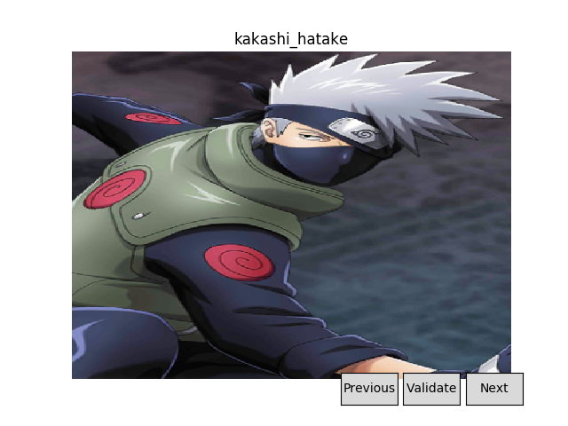
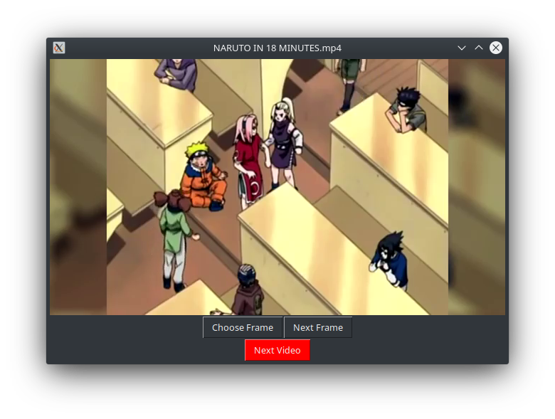

# naruto-cv/dataset

## Notes
There's a bunch of files here, so I'm going to list their utility as such:
1. Image validation
    - `get-image-links.sh` - Generate a file `google_images.txt` (not pre-generated in repo) using `search_characters.txt` as search terms.
    - `image_validator.py` will open a GUI to manually validate images from google images.  It will output `validated_images.json`.
2. Image downloading
    - `download_mal.py` - Downloads images from MyAnimeList.
    - `download_validated.py` - Downloads prevalidated images from the step 1.
3. YouTube frames
    - `youtube_frame_validator.py` - will download youtube videos (to `vid_data/videos`) from links specified in the `main` block, and run a GUI application to go through the frames of the downloaded video. Has command line option for `VALIDATE`, can simply be added on after as 0 or 1. If 0, the script will only download the videos. When manual validation is complete, will output a CSV file (which I already went through and did: `validated_frames.csv`).
    - `youtube_frame_extractor.py` - will use `validated_frames.csv` to download the specified frames into `vid_data/frames` from the videos in `vid_data/videos`.
4. Annotations
    - `annotations/` - manually created with [labelImg](https://github.com/tzutalin/labelImg) given the above images.
    - `vid_data/annotations/` - manually created with [labelImg](https://github.com/tzutalin/labelImg) given the above frames from YouTube. 
5. Dataset Creation
    - `generate_split.py` - Creates a new folder `images/` with subdirectories `test/` and `train/`, along with two CSV label files to denote annotations.
    - `generate_tfrecord.py` - Slightly modified file from [datitran/raccoon_dataset](https://github.com/datitran/raccoon_dataset) to generate TFRecords from the CSV files made in the previous step.

Therefore, the included pre-generated output files are:
 - `validated_images.json`
 - `validated_frames.csv`

## Usage
To create the dataset, simply use the makefile by typing `make`.

Otherwise, you may do the following, which is just what the makefile contains.

To download the full dataset for usage locally, run the following:
```
python3 download_mal.py
python3 download_validated.py
```
```
data/
    character folders.../
```
To then download the videos required for frame extraction, run:
```
python3 youtube_frame_validator.py 0
```
```
vid_data/
    videos/
```
To extract the frames from the downloaded videos, run:
```
python3 youtube_frame_extractor.py
```
```
vid_data/
    videos/
    frames/
```
To then create the usable dataset split and TFRecords, run:
```
python3 generate_split.py
python3 generate_tfrecord.py
```
```
images/
    test/
    train/
    test_labels.csv
    train_labels.csv
train.record
test.record
```


## Extras
If you would like to perform manual validation on the google images downloads:
```
./get-image-links.sh
python3 image_validator.py
```

If you would like to perform manual validation on extra youtube videos:
 1. Add links to the `main` block of `youtube_frame_validator.py`
 2. Run `youtube_frame_validator.py`
 3. Close the first two windows to skip validation on pre-validated videos (or remove these from the `main` block)
 4. Click `Choose` when you want to keep a frame for training.

To create annotations:
 1. Clone [labelImg](https://github.com/tzutalin/labelImg) somewhere 
 2. Run `python3 labelImg.py` from within the repo.
 3. Locate the images downloaded with `Open Dir`
 4. Change the save dir to `vid_data/annotations` for youtube, and each `annotations/` folder for google-images.

#### Image Validator GUI


#### YouTube Validator GUI
